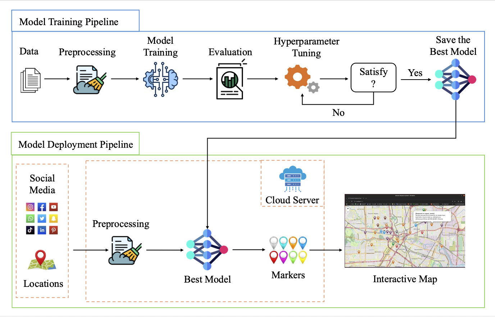
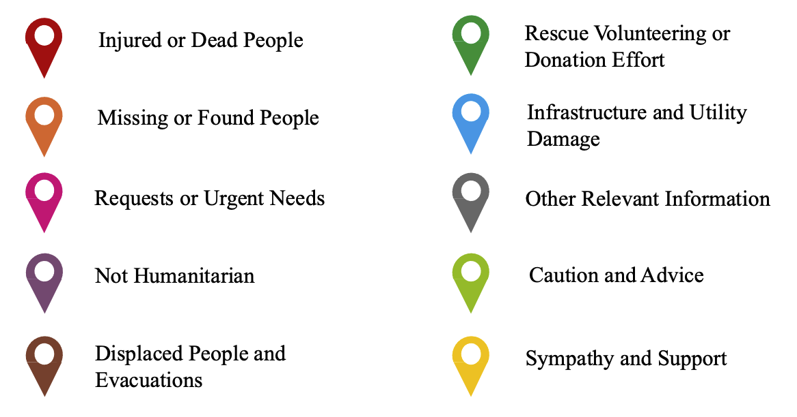
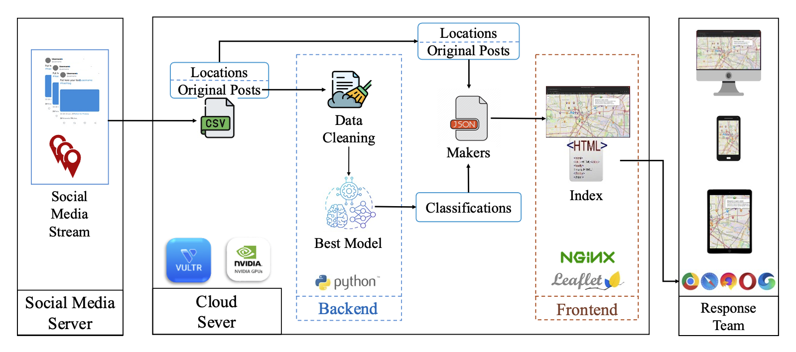
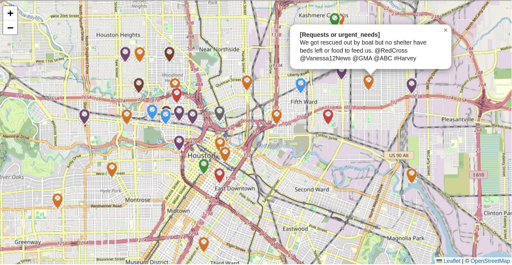

## Social Media Analytics for Disaster Response: Classification and Geospatial Visualization Framework

#### [[Paper]](https://www.mdpi.com/) | [[Video]](https://)

Chao He and Da Hu

Kennesaw State University

This is the official demo code for [[Paper]](https://www.mdpi.com/). 

We develop a disaster response system that can read social media data and do post classification, then visualize the info on map.

<p align="left">
  
</p>

Figure 1. Model training and deployment pipelines


<p align="left">
  
</p>

Figure 2. Markers with corresponding classifications


<p align="left">
  
</p>

Figure 3. The architecture and implementation of the proposed website server.


<p align="left">
  
</p>

Figure 4. Social media information visualization of Hurricane Harvey on map (usernames are ex-cluded from the pop-up windows for privacy consideration).


## 1. Download Dataset
**Dataset** : 
[[HumAID]](https://crisisnlp.qcri.org/humaid_dataset)

Alam, F.; Qazi, U.; Imran, M. HumAID: Human-Annotated Disaster Incidents Data from Twitter with Deep Learning Benchmarks. ICWSM 2021, 15, 933–942, doi:10.1609/icwsm.v15i1.18116.

## 2. Model Training

Create Python environment and install the required packages using Conda:
```bash
conda create --name ModernBert python==3.8
conda activate ModernBert

pip install -r requirements.txt

```

Our Trained Model
**Our trained Model is uploaded to Huggingface** : 
[[Huggingface]](https://huggingface.co/)

## 3. Model Training

Run the training script:
```bash
python train.py


```

## 4. Model Deployment and Visualization on Map


You can deploy it using [[Nginx]](https://nginx.org/)
```bash
# Deploy a cloud server and get a public IP address:
# run nginx
# run the script for reasoning
python3 pridict.py

Open browser and visit https://your-public-ip-address
```

You can test it using python http server
```bash
# run http server
python3 -m http.server 8000

# run the script for reasoning
python3 pridict.py

Open browser and visit https://localhost:8000
```


## Acknowledgement
Great thanks to the [[HumAID]](https://crisisnlp.qcri.org/humaid_dataset), as the dataset is used in our research.

## Cite
If this project is useful in your research, please cite:
> Chao He and Da Hu. "Social Media Analytics for Disaster Response: Classification and Geospatial Visualization Framework", MPDI.
